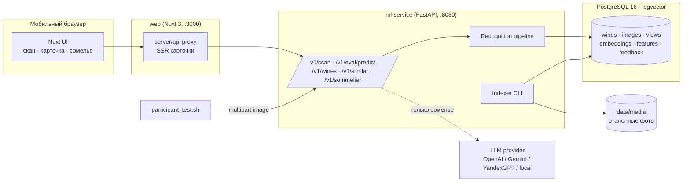
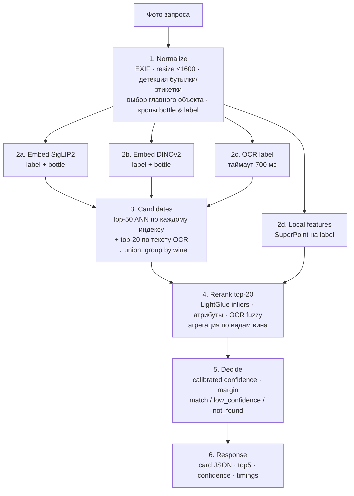
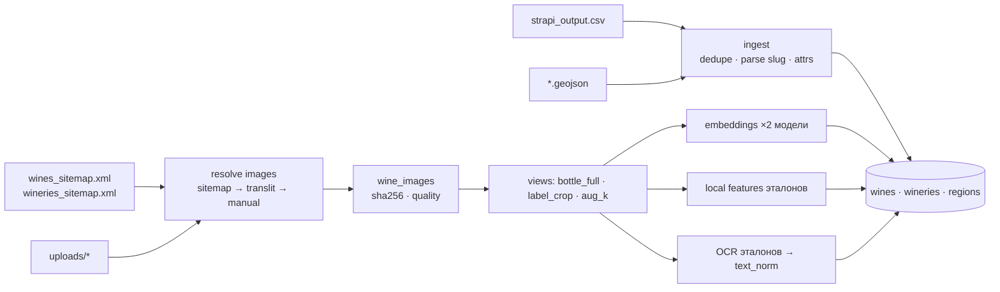

# ARCHITECTURE — «Сканер вина» / Своё Вино

Документ описывает пайплайн и границы слоёв: нормализация фото → извлечение признаков → поиск по каталогу → выдача карточки → дополнительный функционал. Требования — в `TZ.md`, выбор моделей — в `TECH_CHOICE.md`, данные — в `DATA.md`, контракты — в `API.md`, этапы — в `ROADMAP.md`.

## 1. Общая схема



Три процесса, один `docker compose up`: `db`, `ml`, `web`. Скрипт организатора бьёт напрямую в `ml:8080` (минимум накладных расходов); UI ходит через Nuxt BFF, который добавляет SSR карточки и не содержит ML-логики.

## 2. Пайплайн распознавания (горячий путь)



Шаги 2a–2d выполняются параллельно (thread pool; модели освобождают GIL в PyTorch/ONNX). Бюджет на CPU: normalize 60 мс → embed 400–700 мс → OCR ≤ 700 мс (параллельно) → candidates 10 мс → rerank 300–600 мс → итого p50 ≈ 1,2–1,6 с.

### 2.1 Normalize (`pipeline/normalize.py`)

- Вход: bytes → PIL (EXIF transpose, HEIC через `pillow-heif`) → RGB, длинная сторона ≤ 1600.
- Детектор `BottleLabelDetector` (YOLO11n, классы `bottle`, `label`; этап 2 — `HeuristicDetector`: центральная вертикальная область + saliency). Выбор главного объекта: максимум `площадь × центральность`.
- Выход `NormalizedQuery { image, bottle_crop, label_crop, boxes, quality_flags }` (флаги: `no_label`, `blurry`, `low_light`). Кроп этикетки — с полями 8 %, доведение контраста CLAHE в L-канале, подавление бликов (inpaint пересветов > 250 при площади < 3 %).
- Ту же функцию применяет индексатор к эталонам (общий код — отсутствие расхождений между офлайн и онлайн).

### 2.2 Extract (`pipeline/embed.py`, `pipeline/ocr.py`, `pipeline/local.py`)

- `Embedder` — интерфейс `embed(images) -> np.ndarray[N, D]`; реализации `SigLIP2Embedder`, `DINOv2Embedder`. Загружаются один раз при старте, прогреваются.
- `OcrEngine.read(label_crop) -> OcrResult{lines[], text, tokens, year, sweetness, volume, alcohol}` — постобработка регулярками и словарём терминов (`DATA.md` §2.1).
- `LocalFeatures.extract(label_crop) -> {kpts, desc}`; `match(q, ref) -> inliers` (LightGlue + MAGSAC++ гомография, порог репроекции 4 px).

### 2.3 Candidates (`pipeline/search.py`)

- `VectorIndex` — in-memory матрицы по модели (загружаются из pgvector при старте, `float32`, cosine через matmul). Для каждого запроса: top-K видов → агрегация в `wine_id → max(sim)`.
- `TextIndex` — `pg_trgm` similarity по `name_norm`, `winery_norm`, `grapes_norm` + `rapidfuzz.partial_ratio` по OCR-токенам → `text_score`.
- Union кандидатов (≈ 30–60 вин), для каждого — вектор признаков `CandidateFeatures`.

### 2.4 Rerank (`pipeline/rerank.py`)

Признаки пары (запрос, вино): `siglip_label`, `siglip_bottle`, `dino_label`, `dino_bottle` (max по видам), `inliers`, `inliers_ratio`, `text_score`, `year_match ∈ {-1,0,1}`, `sweetness_match`, `volume_match`, `winery_match`, `is_group_member`, `ref_quality`. Реранкер — `Scorer` с двумя реализациями: `LinearScorer` (веса в `configs/pipeline.yaml`) и `LearnedScorer` (sklearn/LightGBM, файл модели в `data/models/`). Выход — отсортированный список с `score ∈ [0,1]`.

Группы одинаковых фото (14): если top-1 в группе, решение внутри группы принимается только по `text_score`/атрибутам, иначе — канонический slug группы.

### 2.5 Decide (`pipeline/decide.py`)

`confidence = calibrator([score1, score1 - score2, inliers1, text_score1])` (isotonic, обучен на валидации).
Правила: `confidence ≥ T_match` → `match`; `T_nf ≤ confidence < T_match` → `low_confidence` (карточка + «похожие» под ней); `< T_nf` → `not_found` (аналоги). Для `/v1/eval/predict` решение не влияет на ответ — всегда `top1.slug`.

### 2.6 Деградация

Любой модуль, кроме `SigLIP2Embedder`, может быть выключен конфигом или упасть по таймауту — пайплайн продолжает с оставшимися признаками и помечает это в `timings`/`warnings`. Это гарантирует ответ скрипту организатора в пределах 10 с curl-таймаута.

## 3. Индексация (офлайн, `svoe_vino index`)



- Идемпотентно: upsert по `slug`; виды/эмбеддинги пересчитываются только при изменении `sha256` файла или версии модели (`model_id` в ключе).
- Команды: `svoe_vino ingest --csv … --uploads … --sitemap …`, `svoe_vino index --models siglip2,dinov2 --views bottle,label,aug`, `svoe_vino report`.
- Инкремент: новый CSV → те же команды; затрагиваются только новые/изменённые slug. Горячая перезагрузка in-memory индекса — `POST /v1/admin/reload` (или рестарт).

## 4. Границы слоёв и структура репозитория

```
vino-svoe/
├── README.md
├── architecture/    ARCHITECTURE.md · TZ.md · DATA.md · TECH_CHOICE.md · API.md · ROADMAP.md
├── backend/         FastAPI + SQLAlchemy (каталог)
├── frontend/        React (Vite)
├── docker-compose.yml · .env.example · Makefile   # целевые (этап 1)
├── configs/         pipeline.yaml (модели, веса, пороги, таймауты) · logging.yaml
├── services/
│   ├── ml/                        Python 3.12, PyTorch — ML-пайплайн / эмбеддинги
│   │   ├── svoe_vino/
│   │   │   ├── api/               routers: scan.py · eval.py · wines.py · similar.py · sommelier.py · admin.py
│   │   │   ├── pipeline/          normalize.py · embed.py · ocr.py · local.py · search.py · rerank.py · decide.py · runner.py
│   │   │   ├── catalog/           ingest.py · image_resolver.py · slug_parser.py · views.py · indexer.py
│   │   │   ├── features/          similar.py (аналоги) · sommelier.py (LLM-провайдеры, промпты, fallback)
│   │   │   ├── db/                models.py (SQLAlchemy) · migrations/ (alembic) · repo.py
│   │   │   ├── eval/              run_public.py · metrics.py · report.py
│   │   │   ├── core/              config.py · logging.py · timing.py
│   │   │   └── cli.py             typer: ingest · index · report · eval · serve
│   │   ├── tests/ · pyproject.toml · Dockerfile
│   ├── siglip-server/             Docker CPU-сервис эмбеддингов
│   └── siglip-hf-endpoint/        handler.py для HF Inference Endpoints
├── data/            (gitignored) raw/ · media/ · models/ · val/ · feedback/ · manual_image_map.csv (в git)
├── eval/            копия participant_test.sh + README организатора · наши манифесты
└── reports/         bench_models.md · public_eval_*.md
```

Правила границ:

- `pipeline/*` не знает о HTTP и БД: принимает `bytes`/`np.ndarray`, возвращает dataclass'ы. Это позволяет гонять его из CLI/тестов и из индексатора.
- `catalog/*` — единственный код, знающий формат Strapi-экспорта. Смена источника (JSON-дамп, REST Strapi) = новый адаптер.
- `api/*` — тонкие роутеры: валидация, вызов `runner`, сериализация по `API.md`.
- `frontend/` не содержит ML- и бизнес-логики: отображает JSON и собирает обратную связь.
- Конфиг один: `configs/pipeline.yaml` + переменные окружения (`DEVICE`, `DATABASE_URL`, `LLM_PROVIDER`, `LLM_API_KEY`, `MEDIA_DIR`).

## 5. API (сводка; полностью — `API.md`)

| Метод | Путь | Назначение |
|-------|------|-----------|
| POST | `/v1/eval/predict` | multipart `image` → `{"slug": "..."}` (контракт организатора) |
| POST | `/v1/scan` | multipart `image` (+ `debug=1`) → карточка, top5, confidence, margin, timings |
| GET | `/v1/wines/{slug}` | карточка вина |
| GET | `/v1/wines/{slug}/similar` | аналоги (3–5) с объяснением |
| POST | `/v1/sommelier` | диалог «цифровой сомелье» (slug, ответы на вопросы) |
| POST | `/v1/feedback` | подтверждение/исправление результата |
| GET | `/v1/health`, `/v1/metrics` | готовность, метрики |
| POST | `/v1/admin/reload` | перезагрузка индекса после `index` |

## 6. Модель данных (PostgreSQL 16 + pgvector)

```
wineries(id, slug, name, name_norm, cover_image, region_id)
regions(id, name, slug, geojson jsonb)
wines(id, slug UNIQUE, name, name_norm, winery_id, region_id, category, color, grapes text[],
      description, sweetness, alcohol numeric, volume numeric, year int, attrs jsonb,
      portal_url, has_image bool, group_id NULL, created_at, updated_at)
wine_image_groups(id, canonical_wine_id, reason)
wine_images(id, wine_id, file_path, sha256, width, height, source enum(sitemap|translit|manual),
            quality enum(ok|screenshot|generated|low), bbox_label int[4], ocr_text, ocr_tokens text[])
image_views(id, image_id, kind enum(bottle_full|label_crop|aug), params jsonb, thumb_path)
embeddings(view_id, model_id, vec vector(768|1152)) -- HNSW cosine index per model_id
local_features(view_id, kpts bytea, desc bytea, n int)
text_embeddings(wine_id, model_id, vec vector(384))     -- для аналогов
scan_log(id, ts, request_id, decision, top5 jsonb, confidence, margin, timings jsonb, image_path NULL)
feedback(id, scan_id, is_correct bool, correct_slug NULL, ts)
```

Индексы: `wines(name_norm gin_trgm_ops)`, `wines(winery_id)`, `embeddings USING hnsw (vec vector_cosine_ops) WHERE model_id = …`. Объём: ~2100 вин × ~10 видов × 2 модели ≈ 42k векторов — < 200 МБ.

## 7. Дополнительный функционал после поиска

- **Аналоги** (`features/similar.py`): кандидаты = pgvector по `text_embeddings` описания (e5) ∩ фильтры (цвет = , сладость = , сорт пересекается ∨ регион =) − та же винодельня (для «аналогов из других виноделен»); объяснение формируется по совпавшим атрибутам без LLM. Используется и в `not_found`, и под карточкой.
- **Цифровой сомелье** (`features/sommelier.py`): конечный автомат из 2–3 вопросов (повод → блюдо/вкус → бюджет/стиль), затем один вызов LLM с системным промптом и данными карточки + до 5 аналогов; ответ структурирован JSON (`recommendation`, `pairing`, `serving_temp`, `why`). Провайдеры за интерфейсом `LLMProvider` (`openai`, `gemini`, `yandexgpt`, `ollama`, `none`). При `none`/ошибке — детерминированный ответ из правил (цвет/сладость/сорт → подача и блюда).
- **Регион на карте** (`RegionMap`): geojson региона из БД, лёгкая SVG-отрисовка без внешних тайлов (офлайн).
- **Обратная связь**: одна кнопка «Это оно?» — копит датасет для калибровки и дообучения.

## 8. Оценка и метрики

- `svoe_vino eval --manifest eval/queries.tsv --answers data/val/answers.tsv` — воспроизводит логику скрипта организатора (последовательно, замер времени) и считает accuracy@1, recall@5, F1@1, F1@5, распределения margin/confidence, p50/p95 по этапам; отчёт → `reports/`.
- В ответе `/v1/scan` метрика уверенности отдаётся как `confidence.top1` и `confidence.top5[]` + `margin` (требование «F1 для топ-1 и топ-5 в API» трактуем как per-request калиброванная уверенность; датасетные F1 — в отчётах).
- Диагностическая страница `/debug` показывает тот же ответ с `debug=1` (кропы, кандидаты, вклад признаков).

## 9. Развёртывание и воспроизводимость

- `docker-compose.yml`: `db` (pgvector/pgvector:pg16), `ml` (образ с предзагруженными весами в volume `data/models`), `web`. Профиль `gpu` добавляет `deploy.resources.reservations.devices` и `DEVICE=cuda`.
- `make setup` — скачивание весов (HF), `make ingest`, `make index`, `make eval`, `make demo`.
- Версии моделей, весов и пороги фиксируются в `configs/pipeline.yaml`; отчёты содержат hash конфига.
- Локальный запуск без Docker: `uv sync` в `services/ml`, `npm i` в `services/web`, PostgreSQL с расширением `vector`.

## 10. Ключевые архитектурные решения (ADR-кратко)

1. **Каскад вместо одной модели** — глобальные эмбеддинги дают recall, локальные признаки + OCR дают precision на near-duplicates. Причина: целевая точность 90 %+ при неразличимых визуально сериях.
2. **Мультивид эталона с аугментациями вместо дообучения на старте** — закрывает доменный разрыв без данных для обучения; дообучение — опция этапа 3.
3. **Python ML-сервис + Nuxt фронт** — Nuxt соответствует рекомендованному стеку и стилистике портала; ML-экосистема (PyTorch, PaddleOCR, LightGlue) — Python. Nuxt не дублирует логику.
4. **pgvector как источник истины + in-memory матрица** — рекомендация организатора и простота; латентность поиска < 5 мс при 50k векторов.
5. **OCR как параллельный ограниченный по времени усилитель** — не блокирует SLA, но решает year/sweetness.
6. **Eval-эндпоинт всегда отвечает slug** — пустой ответ гарантированно неверен; при `not_found` в UI показываем аналоги, а скрипту — лучший кандидат.
