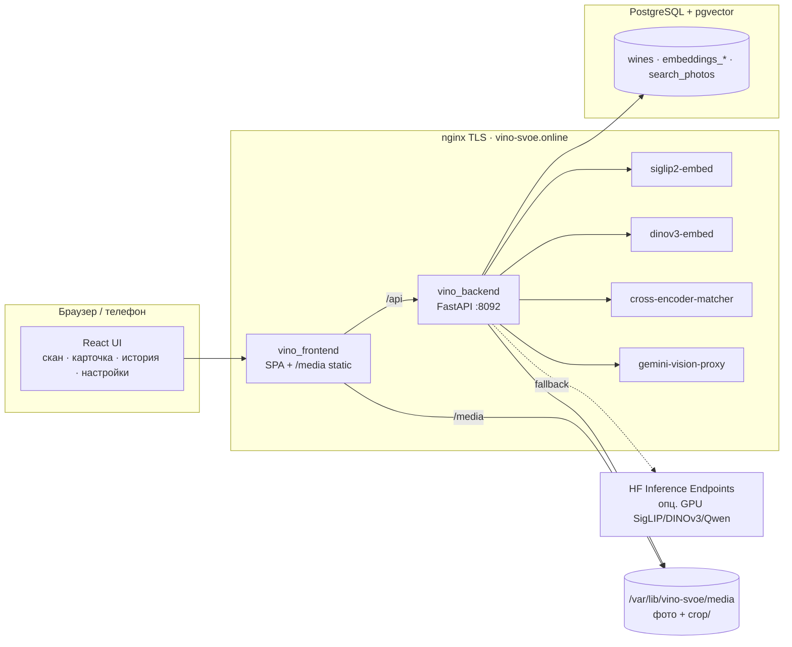
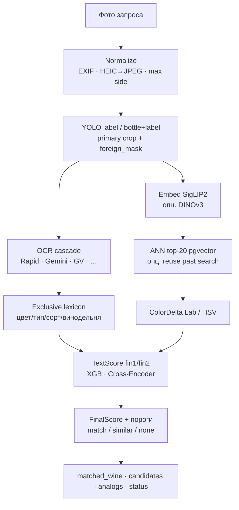

# ARCHITECTURE — Vino Svoe (актуально)

Требования — `TZ.md`, модели — `TECH_CHOICE.md`, данные — `DATA.md`, контракты — `API.md`, этапы — `ROADMAP.md`.  
Детальный алгоритм поиска — [`../docs/findwine-pipeline.md`](../docs/findwine-pipeline.md).  
Деплой — [`../distrib/README.md`](../distrib/README.md).

Версия алгоритма: **`ALGORITHM_VERSION`** в `backend/app/pipeline/version.py` (сейчас 0.97.x).

## 1. Общая схема



На **dev**: Vite `:8091` проксирует `/api` и `/media` на backend `:8092`; медиа с `MEDIA_ROOT` (обычно `…/media/uploads`).

На **проде**: `distrib/docker-compose.yml` поднимает **`vino_postgres`** (pgvector), `vino_backend`, `vino_frontend` в сети `aidispatcher_aidnet`.  
Эмбеддинги **на том же сервере**: `distrib/docker-compose.embeddings.yml` → контейнеры `siglip2-embed` / `dinov3-embed`; nginx проксирует `/api_siglip2`, `/api_dinov3`.  
Cross-Encoder / Gemini proxy — отдельные контейнеры (`/api_cross_encoder_matcher`, `/v1/`).

## 2. Пайплайн распознавания (`POST /api/findwine`)



Ключевые модули (`backend/app/pipeline/`):

| Шаг | Модуль | Суть |
|-----|--------|------|
| Детекция | `yolo_detect.py` | YOLO «label» или «bottle+label»; склейка полосок; primary по силе этикетки на корпусе; foreign_mask |
| Эмбеддинги | `embed_client.py`, `candidates.py` | SigLIP2 (HF → remote CPU → опц. local); DINOv3; HNSW cosine; reuse прошлого поиска |
| OCR | `ocr.py` + LLM/Vision клиенты | RapidOCR всегда доступен; Gemini/OpenAI/DeepSeek/Qwen/Yandex/Google Vision — по настройкам |
| Отсев | `exclusive_lexicon*` | Взаимоисключающие токены (цвет, игристое, сорт, винодельня) |
| Текст | `text_compare.py`, `xgb_match.py`, `crenc_match.py` | Soft TF‑IDF, XGB abs_v14, Cross-Encoder HTTP |
| Цвет | `color_delta.py`, `hsv_match.py` | CIEDE2000 / HSV gates |
| Решение | `findwine.py` | FinalScore, пороги, `matched_wine`, аналоги |

Настройки сканера — UI (роль admin) → `backend/pipeline_settings.json` (+ env для ключей/путей).

## 3. Индексация каталога (офлайн)

Индексация **не** живёт внутри hot-path findwine. Исторически данные готовились скриптами monorepo `research/label_detect/` (соседняя папка на диске):

1. Импорт CSV / sitemap → таблицы `wines`, `wineries`, `wines_sitemap`.
2. Сопоставление фото (`2.crop_wines.py` логика match) → `MEDIA_ROOT` + `crop/`.
3. Embeddings → `embeddings_siglip2`, `embeddings_dinov3`.

Поставка на сервер: SQL-дамп `distrib/sql/vino_catalog.dump.*` (без строк `search_photos` / `search_photo_embeddings`) + rsync медиа/моделей. Миграции схемы — Alembic в `backend/alembic/`.

## 4. Структура репозитория

```
vino-svoe/
├── architecture/          ← эти документы
├── backend/               FastAPI findwine, Alembic, pipeline_settings.json
│   ├── app/pipeline/      алгоритм
│   ├── models/            YOLO *.pt (не в git), XGB model.json (в git), README для CE/SigLIP
│   └── requirements*.txt
├── frontend/              React + Vite (сканер, история, каталог, настройки)
├── distrib/               docker-compose vino_*, nginx template, SQL dump, deploy scripts
├── services/              siglip-server, dinov3-server, cross-encoder, gemini-proxy, HF handlers
├── training/              SigLIP2 Colab + XGBoost train bundle
├── docs/                  findwine-pipeline, contest
├── eval/                  participant_test.sh, queries
└── configs/               вспомогательные конфиги
```

Границы:

- `pipeline/*` — логика поиска; HTTP-обвязка в `routers.py` / `main.py`.
- `frontend/` — UI и site-password gate; не дублирует скоринг.
- Веса больших моделей (`*.safetensors`, YOLO `*.pt`) — volume на диске / внешние сервисы, не Docker-слой приложения.
- Секреты — только `.env` / `distrib/.env` (не в git).

## 5. API (сводка)

Полностью — `API.md`.

| Метод | Путь | Назначение |
|-------|------|------------|
| POST | `/api/findwine` | основной поиск (UI) |
| POST | `/v1/eval/predict` | контракт организатора → `{"slug"}` |
| GET | `/api/wines`, `/api/wines/{slug}` | каталог / карточка |
| GET | `/api/scan-history` | история сканов |
| GET/POST | `/api/settings` | настройки пайплайна (admin) |
| GET | `/api/health` | health + media stats |
| GET | `/media/{path}` | статика (прод: nginx) |

## 6. Модель данных (факт)

Основные таблицы SQLAlchemy (`backend/app/db/models.py`):

```
wineries(id, name, url, photo)
wines(id, wineries_id, name, category, color, region, grape_variety,
      description, winery, slug, photo_name, crop, label, label_ocr jsonb, hsv)
wines_sitemap / wineries_sitemap   — сырой sitemap
embeddings_siglip2(wines_id, embedding vector(768))  — HNSW cosine
embeddings_dinov3(wines_id, embedding vector(…))
search_photos(…)                   — запросы сканера + status jsonb
search_photo_embeddings(…)         — эмбеддинги запросов (reuse)
xgb_exclude_photos                 — исключения из обучения XGB
```

Каталог ≈ 2103 вина; эмбеддинги SigLIP2 ≈ 2084.

## 7. После поиска (retention)

- **Аналоги** — при match: похожие по полям карточки победителя; иначе — по критериям OCR (`pipeline/analogs.py`).
- **История сканов** — UI + denorm для отчётов; ручная привязка `manual_wines_id`.
- **Site gate** — cookie `vino_site_password` (`password_admin` / `password_user`); `/media` публичен для кэша.

«Цифровой сомелье» как отдельный LLM-диалог в текущем UI **не** выделен; упор на аналоги и прозрачный разбор скана (admin).

## 8. Оценка

- `eval/participant_test.sh` → `POST /v1/eval/predict`.
- Метрики и разбор — история сканов, settings, `docs/algorithm-ocr-text-finalscore-f1.md`.
- Latency: цель ≤ 3 с на eval-пути; OCR/LLM доминируют при включённых внешних движках.

## 9. Развёртывание

См. `distrib/README.md`. Кратко:

```bash
# на сервере — приложение + Postgres в Docker
docker compose -f distrib/docker-compose.yml --env-file distrib/.env up -d --build
# embeddings SigLIP2 / DINOv3 на том же хосте
docker compose -f distrib/docker-compose.embeddings.yml --env-file distrib/embeddings.env up -d --build
# media: /var/lib/vino-svoe/media (+ crop/)
# models: /var/lib/vino-svoe/models/{yolo,yolo_bottle_label,xgboost_text_matcher_abs_v14}
# pgdata: /var/lib/vino-svoe/postgres
```

Прод-медиа: nginx `vino_frontend` отдаёт `/media` с `Cache-Control: immutable` (не через FastAPI).

## 10. Архитектурные решения (ADR)

1. **Каскад vision → OCR → lexicon → XGB/CE**, а не одна модель — near-duplicates этикеток.
2. **Эмбеддинги как отдельные сервисы** — общий GPU/CPU кэш на aidispatcher; backend тонкий.
3. **pgvector HNSW** — каталог мал; ANN в той же БД, что и карточки.
4. **React + FastAPI**, не Nuxt/отдельный `services/ml` — одна кодовая база пайплайна и UI-отладки.
5. **Настройки в JSON + admin UI** — быстрый тюнинг порогов без редеплоя кода.
6. **Eval всегда отдаёт лучший slug** (или null только если каталог пуст) — контракт скрипта организатора.
